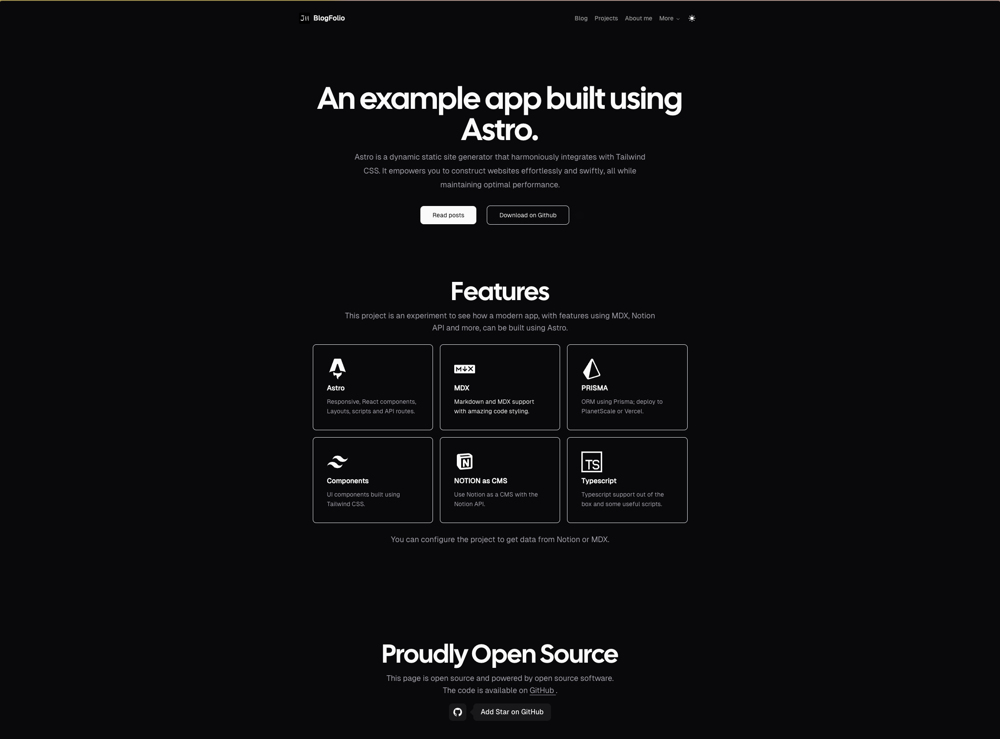

# Blogfolio Astro


[](https://vercel.com/new/git/external?repository-url=https://github.com/jamescardona11/blogfolio-astro)
    

This template is perfect for those who want to use Tailwind CSS and Astro to build a blog. 

It is inspired by many other blogs (see the references bottom of this page), and I started this repository using [Tailwind Astro Starter Project](https://github.com/wanoo21/tailwind-astro-starting-blog/tree/main?tab=readme-ov-file).

Feature request or Facing issue? Check the [discussion page](https://github.com/wanoo21/tailwind-astro-starting-blog/discussions) to see if it has been brought up previously. Otherwise, feel free to start a new discussion thread. All ideas are welcome!

## Demo

[Live Demo](https://blogfolio-astro.vercel.app/) - Deployed on Vercel.

[Images Demo](https://github.com/jamescardona11/blogfolio-astro/tree/master/demo)

## Features

- Astro with Typescript
- Astro MDX support
- Able to use notion as CMS
- Easy styling customization with [Tailwind 3.3](https://tailwindcss.com/blog/tailwindcss-v3-3) and primary color attribute
- Mobile-friendly view
- Light and dark theme
- Automatic image optimization via Astro image component
- Reactions using [Prisma](https://prisma.io/) and [PlanetScale](https://planetscale.com/)
- Combine local data with notion data
- Support for a series of content
- Support switch between list and grid view and keep the state
- Support for tags - each unique tag will be its own page
- Support for nested routing of blog posts
- Projects page
- Resume Page
- Dashboard Page; using wakatime and GitHub stats
- Resume and about me page
- RSS

Even though these features look the same as the original template, they are implemented differently, and there are more to come.

### Missing features
- OpenGraph
- Dashboard lazy loading
- 

## Extend / Customize

`site-metadata.ts` contains a list of constants that you can customize to your liking, including the blog title, description, author, social media links, etc.

`src/lib/providers.config.ts` contains the default data provider configuration; this means where the source of data comes from.

`src/lib/data/local` contains a list of functions and maps to retrieve local information.

`src/lib/data/remote` contains the functions to retrieve information from notion and other remote sources.

`src/lib/data/..-provider.ts` each file represents how the information interacts with the app.

`.env.example` rename to .env and add the environment variables

Change the default view between list and grid; search `SwapViewButtons.astro` for blog or project and set the default view as param.


### Providers configuration

The file `src/lib/providers.config.ts` contains the configuration for providers; if you open a provider file inside `src/lib/data` you can see all providers can fetch data from local or remote you only need to change the configuration for notion or local and everything should be work as the template expected.

After deciding what configuration you want; feel free to delete the other code that is not used

**Current configuration:**
```
export const providersConfig: Provider = {
  resume: 'notion',
  about me: 'local',
  uses: 'notion',
  projects: 'notion',
  blog: 'local'
}
```


### Notion CMS configuration

1- Clone the notion template here: [Notion Template](https://jamescardona11.notion.site/Blogfolio-astro-template-4e95a6ec9dad4f6b9b3ccbe1355d6805)

2- Create a Notion Api; follow the official guide here: [API Setup](https://developers.notion.com/)

3- Choose what pages/databases will fetch information from the notion and set `.env`

4- Change `src/lib/providers.config.ts` configuration for `'notion'`


## 🧞 Commands

All commands are run from the root of the project, from a terminal:

| Command                   | Action                                           |
| :------------------------ | :----------------------------------------------- |
| `npm install`             | Installs dependencies                            |
| `npm run dev`             | Starts local dev server at `localhost:4321`      |
| `npm run build`           | Build your production site to `./dist/`          |
| `npm run preview`         | Preview your build locally, before deploying     |
| `npm run astro ...`       | Run CLI commands like `astro add`, `astro check` |
| `npm run astro -- --help` | Get help using the Astro CLI                     |


### References

- Fonts:
  - https://vercel.com/font
  - https://designermarkdavis.com/Cal-Sans 
  - https://www.hacksoft.io/blog/using-multiple-font-files-the-right-way
  - https://brazy.one/blog/how-to-manage-and-preload-local-fonts-with-tailwind-in-astro/

- Scripts:
  - https://docs.astro.build/en/guides/client-side-scripts/

- Theme
  - https://tailwindcss.com/docs/dark-mode
  - https://medium.com/ageless-dynasty/enable-dark-mode-for-your-astro-website-via-css-variables-9e2a052641b0
  - https://www.kevinzunigacuellar.com/blog/dark-mode-in-astro/


- Tabs
  - https://www.codeconcisely.com/posts/javascript-tabs/

- Copy button
  - https://timneubauer.dev/blog/copy-code-button-in-astro/
  - https://jordemort.dev/blog/adding-copy-buttons-to-code-blocks/


- Skills icons
  -https://iconify.design/

- Routing:
  - https://docs.astro.build/en/core-concepts/routing/

- Headings:
  - https://starlight.astro.build/getting-started/

- Based on:
  - https://tx.shadcn.com/docs
  - https://honghong.me/
  - https://astro.build/themes/details/astros/
  - https://jahir.dev
  - https://www.braydoncoyer.dev/
  - https://delba.dev/
  - https://github.com/jcha0713/astro-notion